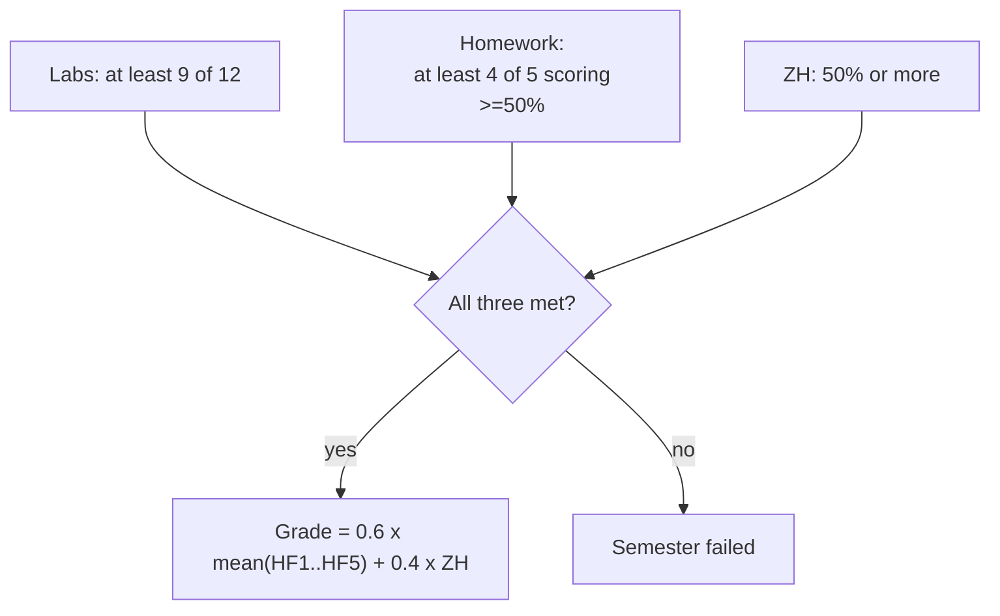

# Lifecycle of Artificial Intelligence Systems

**Course logistics — Autumn 2026**

- How the semester runs
- What you have to do, and by when
- TODO before Wednesday
- Where to read more

<br>

<div class="text-sm opacity-75">
Week 1 · Monday 7 September 2026 · 12:15–14:00
</div>

<!--
This is the administrative half hour.
The deck is published, so nobody needs to copy dates off the screen.

Three things:
(1) the odd/even rhythm of the weeks
(2) the requirement thresholds;
(3) the setup checklist.
-->

---

# Today

1. **Motivation**
2. **Semester structure**
3. **Assessment**
4. **Homework**
5. **Requirements and grading**
6. **Prerequisites and setup**
7. **Resources**
8. **Questions**

<!--
-->

---
layout: section
---

# 1 · Motivation

---

# The MLOps lifecycle

<svg viewBox="0 0 1000 300" xmlns="http://www.w3.org/2000/svg" class="lifecycle">
<defs><marker id="ah" viewBox="0 0 10 10" refX="9" refY="5" markerWidth="7" markerHeight="7" orient="auto-start-reverse"><path d="M 0 0 L 10 5 L 0 10 z" fill="#4f46e5"/></marker></defs>
<rect x="16" y="28" width="168" height="74" rx="10" fill="#4f46e5" fill-opacity="0.10" stroke="#4f46e5" stroke-width="2"/>
<text x="100" y="60" text-anchor="middle" style="font-size:25px;font-weight:700;fill:currentColor">Data</text>
<text x="100" y="84" text-anchor="middle" style="font-size:16px;fill:currentColor;opacity:.7">version + validate</text>
<line x1="189" y1="65" x2="209" y2="65" stroke="#4f46e5" stroke-width="2.5" marker-end="url(#ah)"/>
<rect x="216" y="28" width="168" height="74" rx="10" fill="#4f46e5" fill-opacity="0.10" stroke="#4f46e5" stroke-width="2"/>
<text x="300" y="60" text-anchor="middle" style="font-size:25px;font-weight:700;fill:currentColor">Train</text>
<text x="300" y="84" text-anchor="middle" style="font-size:16px;fill:currentColor;opacity:.7">track every run</text>
<line x1="389" y1="65" x2="409" y2="65" stroke="#4f46e5" stroke-width="2.5" marker-end="url(#ah)"/>
<rect x="416" y="28" width="168" height="74" rx="10" fill="#4f46e5" fill-opacity="0.10" stroke="#4f46e5" stroke-width="2"/>
<text x="500" y="60" text-anchor="middle" style="font-size:25px;font-weight:700;fill:currentColor">Evaluate</text>
<text x="500" y="84" text-anchor="middle" style="font-size:16px;fill:currentColor;opacity:.7">gate: go / no-go</text>
<line x1="589" y1="65" x2="609" y2="65" stroke="#4f46e5" stroke-width="2.5" marker-end="url(#ah)"/>
<rect x="616" y="28" width="168" height="74" rx="10" fill="#4f46e5" fill-opacity="0.10" stroke="#4f46e5" stroke-width="2"/>
<text x="700" y="60" text-anchor="middle" style="font-size:25px;font-weight:700;fill:currentColor">Deploy</text>
<text x="700" y="84" text-anchor="middle" style="font-size:16px;fill:currentColor;opacity:.7">roll out safely</text>
<line x1="789" y1="65" x2="809" y2="65" stroke="#4f46e5" stroke-width="2.5" marker-end="url(#ah)"/>
<rect x="816" y="28" width="168" height="74" rx="10" fill="#4f46e5" fill-opacity="0.10" stroke="#4f46e5" stroke-width="2"/>
<text x="900" y="60" text-anchor="middle" style="font-size:25px;font-weight:700;fill:currentColor">Monitor</text>
<text x="900" y="84" text-anchor="middle" style="font-size:16px;fill:currentColor;opacity:.7">SLOs + drift</text>
<path d="M 900 102 V 174 Q 900 200 874 200 H 126 Q 100 200 100 174 V 110" fill="none" stroke="#4f46e5" stroke-width="2.5" stroke-dasharray="7 5" marker-end="url(#ah)"/>
<text x="500" y="232" text-anchor="middle" style="font-size:18px;fill:currentColor;opacity:.8">the data moves, the model degrades, the requirements change</text>
</svg>

<style>
.lifecycle { width: 100%; max-width: 980px; margin: 1.4rem auto 0; display: block; }
</style>

<!--
Ask who has done any of these steps in a real project.
-->

---

# What this course is not

- **Not a machine-learning course** — the model is deliberately trivial
- **Not a microservices course** — we use exactly as much as serving one model requires
- **Not a cloud course** — everything runs on your laptop; no accounts, no credit card

<br>

# What it **is**
- the practices that keep an ML system alive in production,
- and the judgement to know which of them a given project is worth.

<!--

-->

---
layout: section
---

# 2 · Semester structure

---

# 

<div class="grid grid-cols-2 gap-6">
<div>

### Odd weeks (1, 3, 5, ...)
**In person.**

- **Monday** — practice-oriented lecture
- **Wednesday** — lab

</div>
<div>

### Even weeks (2, 4, 6, ...)
**Online / at home, asynchronous.**

- Read the short theory summary (`docs/notes/`)
- Complete the lab on your own
- Submit it for evaluation

</div>
</div>

<br>

**Both kinds of labs count the same.**


<!--

-->

---

# Timing and location

| | | | |
| :--- | :--- | :--- | :--- |
| **Monday** | Lecture | 12:15–14:00 | IB111 |
| **Wednesday** | Lab | 12:15–14:00 | IL108 |

<br>

### Would you rather start at **12:30** and get a longer lunch break?

<!--
Both days should start at the same time, all semester.
-->

---

# Lab attendance requirement

| Labs held | You need |
| :--- | :--- |
| 13 | 10 |
| 12 | 9 |
| 11 | 8 |

**This semester:** You need to complete **9 out of 12** labs (—1 lab due to TDK on 18 Nov).

**Missed or failed labs cannot be made up.**

<!--

-->

---
layout: section
---

# 4 · Homework

---

# One project, five assignments

- By **week 4** you choose a dataset and a prediction task and get it approved
- Every homework applies that week's lab **to your own project**
- You grow **one repository** across HW1–HW5, from the provided project template
- Worked independently, project-style, with **optional consultation**

<!--
Push them towards a tabular, supervised, medium-sized dataset.
Discourage images, text and anything needing a GPU.
-->

---


# Homework dates

| | Out | Due |
| :--- | :--- | :--- |
| **Project topic selection** | W1 · 7 Sep | **W3** · Sun 27 Sep |
| **HW1** data versioning + tracking | W5 · 5 Oct | **W8** · Sun 1 Nov |
| **HW2** validation + evaluation gates | W7 · 19 Oct | **W10** · Sun 15 Nov |
| **HW3** orchestration | W9 · 2 Nov | **W12** · Sun 29 Nov |
| **HW4** serving + rollout | W11 · 16 Nov | **W13** · Sun 6 Dec |
| **HW5** observability + drift | W13 · 30 Nov | **W14** · Sun 13 Dec |

Three to four weeks each.

Deadlines are **Sunday 23:59**, via your project repository.

<!--
Confirm the deadline day with the group — Sunday night is the default but some cohorts prefer Friday so the weekend is genuinely free.

Late policy: state your own.
The official requirements allow exactly one homework to be made up in the retake week; anything softer than that during the semester is your call and should be announced now.
-->

---
layout: section
---

# 5 · Requirements and grading

---

# Requirements



<!--
-->

---

# Grading

$$
\text{Grade} = 0.6 \times \frac{HF_1 + HF_2 + HF_3 + HF_4 + HF_5}{5} + 0.4 \times ZH
$$

<div class="grid grid-cols-2 gap-8 mt-4">
<div>

| Score | Grade |
| :--- | :--- |
| **85–100%** | 5 — excellent *(jeles)* |
| **70–84%** | 4 — good *(jó)* |
| **55–69%** | 3 — satisfactory *(közepes)* |
| **40–54%** | 2 — pass *(elégséges)* |
| **below 40%** | 1 — fail *(elégtelen)* |

</div>
<div>

- **Homework: 60%**
- **ZH: 40%**
- **No exam**

<br>

The boundaries apply **only if all three requirements are already met**.

</div>
</div>

<!--
-->

---

# Retakes

| Component | Can it be repeated? |
| :--- | :--- |
| **Lab** | **No** |
| **Homework** | **One** of the five, during the retake week |
| **ZH** | Once, during the retake week. **No second retake.** |

<!--
-->

---

# ZH

- **Week 11-14**
- Covering lecture material from **all previous weeks**
- Written
- You will be asked *why* a mechanism is needed, what it costs, and what it fails to catch

<br>

### Exact date, room and format to be confirmed in the first weeks.


<!--
-->

---

# Using AI assistants

**Permitted with one condition:** you must understand and be able to explain **every artifact you
submit**.

You may be asked to explain your submission, in person.


<!--
Frame this as professional practice rather than as a concession. In a real team you are
accountable for what you merge regardless of who or what typed it.

If you plan spot-check conversations on homework, announce that now.
-->

---
layout: section
---

# 6 · Prerequisites and setup

---

# What you are assumed to know

**Required**

- Solid general programming skills
- Git basics (clone, branch, commit, push, PR)
- Python knowledge and experience with its ecosystem (virtual environments, pytest)
- Understanding of machine-learning concepts (data processing, model training, evaluation)

**Not assumed at all**

- Any of the tools we use (Docker, MLflow, DVC, etc.)
- DevOps practices (CI/CD, orchestration, monitoring)

<!--
-->

---

# What you need on your laptop

**Hardware:** 16 GB RAM. Later weeks run several services at once.

| Tool | Needed from | Link |
| :--- | :--- | :--- |
| Git | Week 1 | git-scm.com |
| GitHub | Week 1 | github.com |
| uv (Python package manager) | Week 1 | docs.astral.sh/uv |
| Docker Desktop / Engine + Compose | Week 2 | docs.docker.com/get-docker |
| kind | Week 9 | kind.sigs.k8s.io |
| kubectl | Week 9 | kubernetes.io/docs/tasks/tools |

<!--
On Windows, strongly recommend WSL2 plus Docker Desktop's WSL backend.

Tell them to check free disk space now: the images across the semester add up to roughly
10 GB, and week 10 alone pulls ~2.5 GB.
-->

---

# Before Wednesday

```bash
# 1. Verify the toolchain
git --version
uv --version
docker --version && docker compose version

# 2. Get the course repository
git clone https://vihibxav054-00.github.io/mlops-course && cd mlops-course

# 3. Run the week 1 lab from a clean clone
cd labs/week-01-env-setup/starter
uv sync --locked
uv run --frozen pytest -v
```

<!--
Common causes, in order: no Docker Desktop running, corporate proxy blocking the package
index, an old uv, and a clone inside OneDrive/iCloud.
-->

---

# Where everything lives

| What | Where |
| :--- | :--- |
| The 14-week plan and assessment | `docs/syllabus.md` |
| Short theory summary per week (**your even-week reading**) | `docs/notes/week-XX-notes.md` |
| Lecture slides | published site · `lectures/week-XX-*/` |
| The lab you work in | `labs/week-XX-*/starter/` |
| Homework briefs | `homework/hw-XX-*/README.md` |
| Datasets and the topic catalogue | `datasets/` |
| Reading map — books, courses, papers, per week | `docs/resources.md` |
| ZH revision guide | `docs/exam-revision.md` |

<!--
Fill in the actual channels before the first class: repository URL, the slides site, and
where announcements go (Teams / Moodle / Neptun). Say which one is authoritative for
deadlines — one channel, not three.
-->

---
layout: section
---

# 7 · Resources

---

# Books

- **Chip Huyen — _Designing Machine Learning Systems_** (O'Reilly, 2022)
 — Lifecycle thinking, data engineering, deployment, distribution shift, monitoring.

- **Noah Gift & Alfredo Deza — _Practical MLOps_** (O'Reilly, 2021)
 — Containers, CI/CD, serving, logging.

- **Treveil et al. — _Introducing MLOps_** (2020)
 — short, process- and role-oriented. Weeks 1 and 13.

- **Lakshmanan, Robinson & Munn — _Machine Learning Design Patterns_** (2020)
 — 30 named patterns; the reproducibility ones map onto weeks 2–6.

- **Chen et al. — _Reliable Machine Learning_** (2022)
 — Google SRE practice applied to ML: SLOs, incidents, postmortems. Weeks 11–13.

- **Chip Huyen — _AI Engineering_** (2025)
 — the foundation-model stack, evaluation, RAG, agents. Week 14.

Most of these books are available through most university libraries.

<!--
Do not let anyone think books are required. The per-week reading map in docs/resources.md
points at specific chapters; that is how to use them.
-->

---

# Free courses

**MLOps Zoomcamp — DataTalks.Club** · `github.com/DataTalksClub/mlops-zoomcamp`
- Almost our exact stack: MLflow, Prefect, Docker, Prometheus, Grafana, GitHub Actions, Evidently.
- Self-paced: there is no live cohort, but every video and assignment is open.

**Made With ML — Goku Mohandas (Anyscale)** · `madewithml.com`
- Strong on software-engineering rigor: testing, pre-commit, CI/CD, experiment tracking.

**ml-ops.org — INNOQ** · `ml-ops.org`
- Concise, free reference on MLOps principles and the end-to-end workflow.
- Good first reading for week 1.

<!--
-->

---

# GitHub Repositories

- **`DataTalksClub/mlops-zoomcamp`** — the companion course above, with code
- **`GokuMohandas/Made-With-ML`** — a production ML codebase you can read end to end
- **`graviraja/MLOps-Basics`** — one project built week by week across DVC, MLflow, Docker,
  FastAPI and monitoring
- **`kelvins/awesome-mlops`** and **`visenger/awesome-mlops`** — two curated tool and
  reading lists

<!--
Encourage reading other people's repository structure early.
-->

---

# Papers

- **Sculley et al., "Hidden Technical Debt in Machine Learning Systems"** (2015)
- **Zinkevich, "Rules of Machine Learning"** (2017, Google)
- **Breck et al., "The ML Test Score"** (2017)
- **Mitchell et al., "Model Cards for Model Reporting"** (2019)
- **Google SRE Workbook, "Implementing SLOs"**

<!--
If you assign exactly one reading all semester, make it "Rules of Machine Learning" in the first fortnight.
-->

---
layout: section
---

# 8 · Wrapping up

---

# Before you leave

**This week**

- Install Git, uv and Docker; clone the repo; get `pytest` green in the week 1 lab
- Skim `docs/syllabus.md`

**By Sunday 27 September**

- Choose your project topic and submit it for approval

**Wednesday, 12:15**

- Lab 1: environment setup. Bring your laptop.

<!--
End on the concrete next action.
-->
