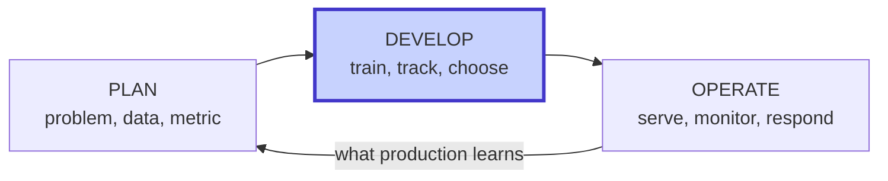
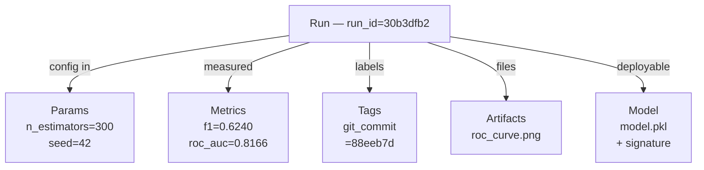
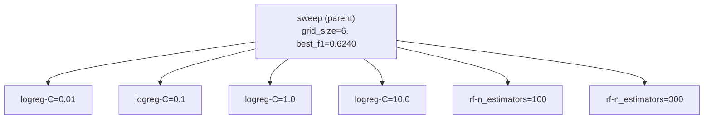
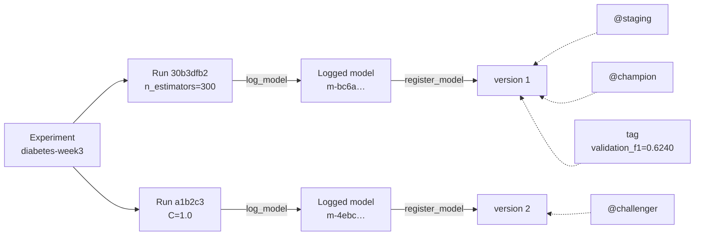
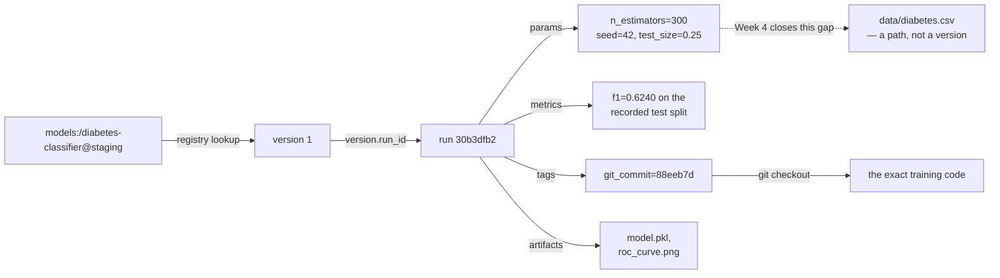

# Week 3: Experiment Tracking

**Lifecycle of Artificial Intelligence Systems**

- Params, metrics, tags, artifacts
- Parameter sweeps and comparing many runs
- The model registry: names, versions, aliases
- Promotion and traceability: proving what you shipped

---

# The Epic Sepsis Model

**Sepsis** is the body's extreme response to an infection: organ dysfunction that kills. About **1.7 million** US adults get it each year, and **at least 350,000** die in hospital or are discharged to hospice.

Two things make it a natural target for a model:

- **There is no confirmatory test.** Recognition is a judgement call on non-specific signs — fever, fast heart rate, confusion, breathlessness, clammy skin — that a dozen other conditions also produce.
- **It is a race against time.** A study of septic-shock patients reported a mean **7.6% rise in mortality per hour** of delayed antibiotics.

Epic shipped one inside its medical software:
- a **penalized logistic regression**, proprietary, scoring every patient **every 15 minutes** from arrival.
- Epic's own documentation reported an **AUC of 0.76-0.83**.

<!--
Sources: CDC sepsis burden page (1.7 million / 350,000 / one in five, as published 2026);
Kumar et al., Crit Care Med 2006;34(6):1589-1596 (2,731 patients, mean 7.6% per hour — widely cited, and later work disputes the exact slope, so present it as what that study reported); model description from Wong et al. 2021, below. All re-verified 2026-09-16.

Spend the time on the second bullet. The reason this case is the right cold open for an
experiment-tracking lecture is that the task is genuinely hard and the model was a reasonable
thing to build. Nothing here is a story about incompetence.
-->

---

# ...then somebody checked it

In 2021 researchers at Michigan Medicine validated it externally[^1][]:

- Epic recommends alerting somewhere in the score range **5-8**; Michigan Medicine used **≥ 6**.
- measured **AUC 0.63** (vs. 0.76-0.83 in Epic's own documentation)
- at the threshold the hospital actually ran, **sensitivity was 33%**
- it missed **1,709 of the 2,552** sepsis cases
- while still alerting on **18%** of all hospitalizations

<br>

> [!CAUTION]
> Each domain has its own vocabulary. In medical diagnostics, **sensitivity** is what we call **recall**: the fraction of true positives correctly identified.

[^1]: over **27,697 patients / 38,455 hospitalizations**, of which 2,552 had sepsis

<!--
Source: Wong et al., "External Validation of a Widely Implemented Proprietary Sepsis Prediction
Model in Hospitalized Patients", JAMA Internal Medicine 2021;181(8):1065-1070. PMID 34152373.

Say once that sensitivity in medical diagnostics is what we call recall: the fraction of true positives correctly identified.

The last two bullets are the pair that matters: missing two thirds of the cases WHILE paging on nearly a fifth of all admissions. A model can be both too quiet and too loud at once.

Do NOT claim Epic had no internal experiment tracking — we do not know that, and it is not the point.
-->

---

# Five questions a hospital should have been able to ask

| **A question a hospital should be able to ask** | **What was actually available** |
| --- | --- |
| Which version of the model is running right now? | A vendor build number, if that |
| What data was it trained on? | Not disclosed |
| Which measured numbers justified deploying it? | The vendor's own, unvalidated |
| Who approved it, and against what threshold? | No published record |
| How do we roll back if it is wrong? | Undefined |

<!--
Read the left column out loud and pause. Then promise the mapping and keep it: version -> model
version, data -> Week 4, numbers -> run metrics, approval -> version tags, rollback -> alias.
Come back to this table on the takeaways slide.

Optional second beat if the room is engaged: McKinney et al., Nature 577 (Jan 2020), claimed
radiologist-beating breast-cancer screening; Haibe-Kains et al., Nature 586 E14-E16 (Oct 2020)
formally argued it could not be reproduced because code and model were withheld. Weaker as a
lead because it is a publication dispute rather than an operational failure — but it lands the
same point about who can check.
-->

---

# Look out for the same in academia

**January 2020** — McKinney et al. publish an AI breast-cancer screening system in *Nature* (577:89-94), reporting performance above the radiologists it was compared against.

**October 2020** — Haibe-Kains et al. reply in *Nature* (586:E14-E16): the result **cannot be independently reproduced**, because the model, the code and the exact training data were not released.

The authors' own reply does not dispute that. It argues the constraints were legitimate.

> Nobody here was careless. The record that existed was a paper, and a paper is not a chain you can walk.

<!--
Sources: McKinney et al., Nature 577:89-94 (Jan 2020), PMID 31894144. Haibe-Kains et al.,
"Transparency and reproducibility in artificial intelligence", Nature 586:E14-E16 (Oct 2020),
PMID 33057217, with the authors' reply at E17-E18, PMID 33057218. Verified 2026-09-16.

The point of pairing: one is a vendor protecting a product, one is an academic group
publishing a result, and in both the thing that failed was an outsider's ability to check.
-->

---

# Where we are: still in "develop"



Weeks 1-2 gave the develop phase a **runtime** it could reproduce.

Week 3 gives it a **record** somebody else can check.

<!--
The dashed edge is the week's contribution, not a fourth phase.
-->

---

# Last week you logged one training run

```python
with mlflow.start_run():
    mlflow.log_param("random_seed", settings.random_seed)
    mlflow.log_param("test_size", settings.test_size)
    mlflow.log_param("max_iter", settings.max_iter)
    for name, value in metrics.items():
        mlflow.log_metric(name, value)
    mlflow.sklearn.log_model(model, name="model")
```

That produced **one row** in MLflow.

<!--
Point at the three separate log_param calls and the metric loop — that is the "before" picture
for the lab's Exercise 1, which replaces both with single batched calls.
-->

---

# One run is not an experiment

With one row you cannot:

- rank anything — there is nothing to rank against
- see whether a change helped or hurt
- say which model is the model, the one you would defend

<br>

And nothing in that snippet records:
- which code produced it,
- what the errors looked like, and
- what the model expects as input.

<br>

> The infrastructure is ready but the best practice is not yet in place.

<!--
Ask what is missing rather than what is wrong: no tags (so no git commit, and no way to find
this run later), no plots, and no model signature. Those four gaps are Exercises 1 and 2.
-->

---

# Learning objectives

By the end of this lecture, students should be able to:

- classify a piece of run information as a param, a metric, a tag, or an artifact — and say why it matters
- design a parameter sweep as a parent run with child runs, and compare the results
- log plots as run artifacts and explain why a screenshot is not one
- explain the registry object model — registered model, version, alias, tag — and register a model version
- walk the traceability chain from a deployed alias back to the params, metrics, and code that produced it

---
layout: section
---

# 1 · Tracking

---
layout: center
---

# What is generated by a training run?

---

# The anatomy of a run



<!--
This is the organising picture for the whole first hour — come back to it.

The single run_id on the left is the thing that ties all five together, and it is what the
traceability slide later depends on.
-->

---

# Recap: Where should each kind of output live?

| Output | Where it goes | Why |
| --- | --- | --- |
| <span v-click="1">Params, metrics, tags</span> | <span v-click="3">**Postgres** — backend store</span> | <span v-click="4">Small, structured, queryable</span> |
| <span v-click="2">Artifacts, the model</span> | <span v-click="5">**MinIO** — artifact store</span> | <span v-click="6">Large opaque blobs, fetched whole</span> |


---

# Four kinds of metadata, four different jobs

| | **What it is** | **Mutable?** | **Searchable?** | **Example** |
| --- | --- | --- | --- | --- |
| **Param** | An input you chose | No | Yes | `n_estimators=300` |
| **Metric** | A number you measured | Append-only series | Yes | `f1=0.6240` |
| **Tag** | A free-form label | Yes | Yes | `git_commit=88eeb7d` |
| **Artifact** | A file | No | No — by path only | `roc_curve.png` |

<br>

> [!CAUTION]
> MLflow accepts a value in any of these places. It cannot tell you whether it belongs there.

<!--

-->

---

# Four verbs: reproduce, find, compare, deploy

<br>

- **Params** exist so someone can **reproduce** a run.

- **Tags** exist so someone can **find** it.

- **Metrics** exist so you can **compare** runs.

- **Artifacts** exist so you can **inspect and deploy** them.

<br>

> If you cannot say which verb a value serves, you do not yet know where to log it.

<!--
This is the slide worth memorising, and it is what Exercise 1 is actually graded on: the
classic taxonomy error (logging a result as a param) is a deduction in the rubric.
-->

---
layout: image-right
image: /mlflow-logo.svg
backgroundSize: 50%
backgroundPosition: center
---

# MLflow

**MLflow is an open-source platform for managing ML projects.**

It gives a place to:

- record parameters, metrics, and tags
- store models and other run artifacts
- retrieve the complete record of a run later

---
layout: image
image: /mlflow-tracking-setup-overview.png
backgroundSize: 80%
---

---

# Experiment vs. run

An experiment is a question you are trying to answer.

A run is one data point.

```python
mlflow.set_experiment("diabetes-random-forest")   # the question
with mlflow.start_run(run_name="rf-n_estimators=300"):   # one attempt
    ...
```

- `diabetes-random-forest` — a question, with a scope someone else can understand
- `test2`, `final`, `final_v2_actually_final` — not questions

> [!NOTE]
> Run **names** are for humans and need not be unique; run **IDs** are what code and links use

> [!IMPORTANT]
> Put runs you want to compare in the *same* experiment.

Everything on the next few slides — the compare view, the parallel-coordinates plot, `search_runs` — works within one experiment.

---

<style>
.slidev-layout table th,
.slidev-layout table td {
  padding-top: 0.5rem;
  padding-bottom: 0.5rem;
}
</style>

# `autolog` vs. explicit logging

| | `mlflow.autolog()` | Explicit `log_params` / `log_metrics` |
| --- | --- | --- |
| **Setup cost** | One line | One call per group |
| **What lands** | Everything the framework exposes | Exactly what you chose |
| **Noise** | High — dozens of sklearn defaults you never set | None |
| **Reviewability** | A reader cannot tell what you *meant* to vary | The diff shows your intent |
| **Prefer it when** | Working with code you do not own | Logging for your specific needs |

> [!CAUTION]
> This course logs explicitly, because here the params *are* the teaching content.

> [!TIP]
> In your own exploratory work, `autolog()` is often the right call.

<!--
Be honest here: autolog is genuinely good and students will use it. The argument is not that it
is bad, it is that it hides the decision you are being taught to make. Also worth mentioning:
autolog captures a fixed set per flavour, so mixing it with explicit calls is normal.
-->

---

# A metric is a time series that usually has one point


---

# A metric is a time series that usually has one point

```python
mlflow.log_metric("f1", 0.6240)             # step defaults to 0
mlflow.log_metric("loss", 0.31, step=epoch) # one point per epoch
```

<br>

Every metric in MLflow has a **step** axis, because metrics were designed for training curves.

- Our scikit-learn baseline fits once, so each metric has a single point
- A neural net logs one point per epoch; a sweep can log one point per trial

<br>

> [!TIP]
> Logging one point per monitoring window creates a drift chart.

---

# Logging a plot

```python
fig = confusion_matrix_figure(model, x_test, y_test)
mlflow.log_figure(fig, "plots/confusion_matrix.png")
```

`log_figure` sends the figure straight to the artifact store.

<!--

-->

---

# How to make plots comparable

- use the **same figure size** and layout
- keep **colors semantic and stable**: positive / negative classes must not swap
- fix **axis limits and tick locations** when comparison matters
- label every axis, unit, class, and threshold
- use a colorblind-safe palette; do not rely on color alone
- save at a readable resolution and log the plotting code or configuration


---

# One sweep, many runs

```python
with mlflow.start_run(run_name="sweep"):          # the parent: the question
    for family, hyperparams in SWEEP_GRID:
        with mlflow.start_run(nested=True):       # a child: one data point
            ...
```



> [!CAUTION]
> Without `nested=True` you get seven unrelated top-level runs.

The parent contains the sweep; each child holds one result.

<!--
Also flag the invariant students break most: every cell must reuse the SAME train/test split.
Re-randomise per cell and the comparison is meaningless.
-->

---

# Four ways to compare runs in the UI

| View | The question it answers |
| --- | --- |
| **Run table**, with sortable metric columns | "Which run scored best on the metric I care about?" |
| **Chart view** | "How does this metric move as I change that param?" |
| **Parallel coordinates** | "Which *combination* of settings is in the good region?" |
| **Run detail + artifact browser** | "What did this one run do, and what does its ROC curve look like?" |

Select several runs → **Compare** → parallel coordinates: one line per run, one vertical axis per param and metric.

> If you are scrolling a run list, you are doing it wrong. Sort, filter, or chart.

<!--
Ten minutes in the UI here is worth more than any slide. Drive it live if the stack is up — run
the sweep before the lecture so there are six runs in front of the room to compare.
-->

---

# Run search is a query

<br>

```python
mlflow.search_runs(
    experiment_names=["diabetes-week3"],
    filter_string="tags.sweep = 'week3-baseline' and metrics.f1 > 0.55",
    order_by=["metrics.f1 DESC"],
)   # -> return a pandas DataFrame
```

<br>

> [!NOTE]
This filter runs **on the server, against Postgres**, not on a full download you then filter in pandas.

<!--
-->

---

# But its syntax has some traps...

| Filter clause | Matches on |
| --- | --- |
| `metrics.f1 > 0.55` | A measured number — bare, unquoted |
| `params.C = '1.0'` | A param — **always a string**, single-quoted |
| `tags.git_commit = '88eeb7d'` | A tag |
| `attributes.status = 'FINISHED'` | The run itself |

1. The operator is `=`, **not** `==`.
2. Param values are **strings**. `params.C = 1.0` silently matches nothing.
3. A filter that matches nothing returns an **empty frame, not an error**.

<!--
Trap 3 is the dangerous one, the wrong answer and the no-answer look identical.
-->

---
layout: section
---

# 2 · The registry
## Deciding what to ship

---

# Tracking cannot answer "what are we serving?"

You have run the sweep. You know run `30b3dfb2` won. Now ship it.

```
runs:/30b3dfb252fc4ff9adacf878c6ecbf75/model
```

That is an address that:

- nobody can remember, type, or recognise in a code review
- nobody **approved** — winning a sweep is not a decision
- carries no version number, so rollback is quite the challenge
- says nothing about who signed off, against what threshold, or when

<br>

> [!NOTE]
> A deployable model needs a name, a number, and a record of the decision to ship it.

<!--
Everything before it was tracking; everything after it is
governance.
-->

---

# The registry object model

Both versions below live under one **registered model**, `diabetes-classifier`.



<!--
Draw attention to the arrow directions. Registration flows left to right and never reverses,
while aliases point backwards from a name to a version.
-->

---
layout: image
image: /model-registry.png
backgroundSize: 80%
---

---
layout: image
image: /model-page-view.png
backgroundSize: 80%
---

---
layout: image
image: /model-registry-dash.png
backgroundSize: 80%
---

---

# Concepts to remember

- **Experiment** — the question you were asking
- **Run** — one execution that tried to answer it
- **Version** — an immutable, numbered snapshot of one run's model, under a registered name
- **Alias** — a mutable, arbitrary name pointing at exactly one version
- **Tag** — a key/value fact attached to a version

<br>

> Runs and versions are append-only history.

> Aliases and tags can be moved.

<!--
Two versions can come from one experiment; a version comes from exactly ONE run — and that
invariant is what makes the traceability slide possible.

@champion and @staging sit on the same version in the diagram. That is deliberate
foreshadowing for the stages-vs-aliases slides.
-->

---

# Run vs. registered version

| | **Run** | **Registered model version** |
| --- | --- | --- |
| **Identity** | <span v-click>`run_id`</span> | <span v-click>`name` + an integer version</span> |
| **Created by** | <span v-click>Executing training code</span> | <span v-click>A *decision*, after evaluation</span> |
| **Immutable?** | <span v-click>Metrics append; params fixed</span> | <span v-click>Fully immutable</span> |
| **Named by** | <span v-click>Whoever ran it, casually</span> | <span v-click>Naming standard</span> |
| **Answers** | <span v-click>"What did we try?"</span> | <span v-click>"What are we shipping?"</span> |
| **How many exist** | <span v-click>Hundreds. Mostly noise.</span> | <span v-click>A handful. All meaningful.</span> |

<span v-click>Every version came from exactly one run.</span>

---

# Registering a model version

```python
# A: register automatically during training
mlflow.sklearn.log_model(model, name="model",
                         registered_model_name="diabetes-classifier")

# B: register deliberately, after you have compared runs
mlflow.register_model(model_uri=f"runs:/{best_run_id}/model",
                      name="diabetes-classifier")
```
<span v-click>

**This course prefers B:**

- With A, every training run registers a version filling the registry with noise.
- With B, registration happens *after* the sweep, once you know which run won.

<br>

> [!NOTE]
> Registration is a decision made after evaluation, not a side effect of training.

</span>

<!--
The lab uses form B, and there is a second, sharper reason covered in registry.py: only the
runs:/ URI form records run_id on the resulting ModelVersion against the open-source registry.
Register from the model_info.model_uri that log_model returns (models:/m-<id> in MLflow 3) and
run_id comes back empty — which silently breaks the traceability chain two slides from now.
-->

---

# Stages and aliases, side by side

| | Stages (MLflow ≤ 2.x) | Aliases + tags (MLflow 3.x) |
| --- | --- | --- |
| **API** | `transition_model_version_stage(name, v, "Staging")` | `set_registered_model_alias(name, "staging", v)` |
| **Vocabulary** | Four fixed words: None / Staging / Production / Archived | Any name: `staging`, `champion`, `challenger`, `eu-prod` |
| **How many per version** | Exactly one stage | Many aliases, plus version tags alongside |
| **Reference from code** | `models:/diabetes-classifier/Production` | `models:/diabetes-classifier@champion` |
| **Shape** | A state machine your process must fit into | Plain pointers |

<!--
Aliases are deliberately less clever: a mutable name pointing at an immutable version, and
nothing else. The docs' own mapping is Production ≈ champion.
-->

---

# Vocabulary of aliases

Your colleagues will say *"push it to staging."*

| Common alias | Meaning |
| --- | --- |
| `@staging` | Candidate being checked before wider use |
| `@champion` | Current preferred production model |
| `@challenger` | Candidate measured against the champion |
| `@eu-prod` | Model assigned to a specific deployment context |
| move `@champion` | Roll back the serving role to an earlier version |

> [!IMPORTANT]
> These are conventions, not built-in MLflow states. An alias is simply a name your team chooses.

<!--
This is the week's required-deviation slide, in the same spirit as Week 2's containerised
MLflow server.

The "a name we chose" point is graded: an answer to Exercise 6 that treats `staging` as a
built-in MLflow concept gets no credit for that part.
-->

---

# Promotion is a process...

| **Gate** | **Evidence required?** | **Who signs?** | **When?** |
| --- | --- | --- | --- |
| Offline metric threshold | <span v-click="1">Candidate beats the current champion's recorded metric</span> | <span v-click="2">Data Scientist</span> | <span v-click="3">**This week**</span> |
| Slice + fairness check | <span v-click="4">No subgroup regresses below a floor</span> | <span v-click="5">Data Scientist</span> | <span v-click="6">**Week 6**</span> |
| Shadow / canary traffic | <span v-click="7">Real traffic, no error-rate regression</span> | <span v-click="8">Service owner</span> | <span v-click="9">**Week 10**</span> |
| Sign-off record | <span v-click="10">Who approved, on what evidence, when</span> | <span v-click="11">Product Manager</span> | <span v-click="12">**This week**</span> |

<!--
Say this explicitly: designing real quality gates — metric-regression tests, acceptance criteria
as code, slice metrics, formal go/no-go rules — is WEEK 6. Today is the mechanism, not the
policy. If you spend twenty minutes on gate design here you will have nothing left for Week 6.
-->

---

# The alias assignment is only its last line of code

```python
client.set_model_version_tag(name, v, "validation_f1", "0.6240")
client.set_model_version_tag(name, v, "promoted_by", "your-name")
client.set_registered_model_alias(name, "staging", v)
```

- The first two are the **evidence**.
- The third is the **promotion**.

<!--
Point out that the alias assignment is a simple operation, but it's the last step in a process that should be carefully considered. The function `promote_to_staging` reads the metric back from the SOURCE RUN rather than
trusting a variable in scope, so the tag cannot drift from what was measured. The lab's version
records four version tags this way, plus two tags on the registered model itself.
-->

---

# Tracing back from the alias

<br><br>



> [!IMPORTANT]
> Traceability means that someone else can independently verify.

<!--
Walk this backwards on the board, out loud, in the order the arrows are drawn.

Then point at the dashed node and say nothing more about it. It is next week's cliffhanger and
it should itch.
-->

---

# The audit question, answered in four hops

*"You deployed a diabetes classifier. I need to know everything about it."*

<br>

1. **`models:/diabetes-classifier@staging`** → the registry resolves the alias to **version 1**
2. **version 1** → `.run_id` → **run `30b3dfb2`**
3. **run `30b3dfb2`** → its params: `n_estimators=300`, `random_seed=42`, `test_size=0.25`
   → its metrics: `f1=0.6240`, `roc_auc=0.8166`, `recall=0.5821`
   → its tags: `git_commit=88eeb7d`
   → its artifacts: the ROC curve and confusion matrix used to justify it
4. **`git checkout 88eeb7d`** → the exact training code

<!--

-->

---

# What to use in deployment code: alias or version?

```python
model = mlflow.sklearn.load_model("models:/diabetes-classifier@champion")   # an alias
model = mlflow.sklearn.load_model("models:/diabetes-classifier/7")         # a version
```

<span v-click>

Advantages of the alias:

- promoting a new champion needs **no code change and no redeploy**
- **rollback is a pointer move**: point `@champion` back at version 6
- the diff in code review says *what the service does*, not which build won last month
- two aliases can coexist, so `@champion` serves traffic while `@challenger` runs in shadow

</span>

---

# Traps to watch for

| Trap | What you see | What is wrong |
| --- | --- | --- |
| Registering from `model_info.model_uri` | `make trace` dead-ends | `run_id` is **empty**; use `runs:/<run_id>/model` |
| `params.C = 1.0` in a filter | Zero rows, no error | Param values are **strings**: `'1.0'` |
| Docker naming | Week 2's containers come back | Compose names the project after the *directory* |
| A sweep opening 12 figures | `More than 20 figures...` | No `plt.close(fig)` after `log_figure` |
| `model.pkl` under the run | Not there | MLflow 3 files it at `<exp>/models/m-<hex>/` |

<!--
Every one of these was measured while building the lab, and every one is in the README's
troubleshooting table so students can find it mid-session.

Pre-empt the registration warning here — "Run with id ... has no artifacts at artifact path
'model'" — or ten students will report it as a bug.
-->

---

# Lab, part 1 — tracking (Exercises 1-3)

| # | Exercise | What you prove |
| --- | --- | --- |
| 1 | Log one run properly | Batched params, searchable tags incl. `git_commit`, five metrics, a model with a schema |
| 2 | Log two plots as artifacts | ROC curve and confusion matrix render in the UI, under the run |
| 3 | Sweep six configurations | One parent run, six children, comparable in the parallel-coordinates view |

The infrastructure does not change this week. `compose.yaml` is the Week 2 stack, unchanged — **every exercise is in Python.**

<!--
Remind them to stop the Week 2 stack first: every lab in this course shares the 55xx host
ports, so only one stack can run at a time.
-->

---

# ROC curves and AUC scores

<div class="auc-images">
  
  
  
</div>

<style>
.auc-images {
  display: grid;
  grid-template-columns: 1fr 1fr;
  gap: 0.7rem;
  align-items: stretch;
}

.auc-images img {
  width: 100%;
  height: 100%;
  max-height: 43vh;
  object-fit: contain;
}

.auc-images img:first-child {
  grid-column: 1 / -1;
  max-height: 10vh;
}
</style>

---
layout: image
image: /auc_abc.png
backgroundSize: 60%
---

---

# Lab, part 2 — the registry (Exercises 4-6)

| # | Exercise | What you prove |
| --- | --- | --- |
| 4 | Find the winner without scrolling | A server-side `search_runs` filter ranks the runs — and F1 and ROC-AUC disagree |
| 5 | Register the winning model | `diabetes-classifier` version 1 exists and links back to its source run |
| 6 | Promote with an alias, then trace back | `@staging` and `@champion` on one version, and a four-hop walk to the params |

Exercises 4 and 6 also want a **written answer**, in `answers.md`.

<!--
Exercise 4 is the one students under-estimate. The written half is not a formality: the two
metrics genuinely disagree, and "the highest F1 wins" is marked wrong.
-->

---

# Also due this week: your project topic

Your **project topic** proposal is due **Sunday 27 September, 23:59** — the end of this week.

- one page, committed as `docs/proposal.md` in **your own** project repo, created from the course project template
- a dataset and a single supervised prediction task you can carry through **HW1 to HW5**

Graded **approve / request changes**. Every one of the five homework assignments builds on it.

<!--
Do not skip this slide. It is the only hard deadline that falls inside Week 3, and a student
who misses it has nothing to build HW1 on two weeks from now.

Check the course page for the exact submission link before presenting.
-->

---

# What you will do in Exercise 3

```python
# src/week_03_mlflow_integration/tracking.py (solution)
with mlflow.start_run(run_name=run_name, nested=nested) as run:
    mlflow.log_params({"model_family": family, "random_seed": settings.random_seed,
                       "test_size": settings.test_size, **hyperparams})
    mlflow.set_tags({"model_family": family, "git_commit": git_commit(),
                     "sweep": sweep_tag})

    model = build_model(family, hyperparams, settings)
    model.fit(x_train, y_train)
    metrics = evaluate_model(model, x_test, y_test)
    mlflow.log_metrics(metrics)

    mlflow.log_figure(roc_curve_figure(model, x_test, y_test), "plots/roc_curve.png")

    mlflow.sklearn.log_model(model, name="model",
                             signature=infer_signature(x_train, model.predict(x_train)),
                             input_example=x_train.head(3))
```

Compare with Week 2's version on slide 4: batched calls, tags, a plot, and a signature.

<!--
Two things to point at explicitly.

First, name="model". MLflow 3 deprecates the older artifact_path= spelling, and passing both
is an error. Mention it because every tutorial written before MLflow 3 uses artifact_path.

Second, the signature. infer_signature is what populates the Schema tab in the UI, and it is
what a serving runtime reads to validate incoming requests in Week 9. It also emits a warning
on our dataset about integer columns not being able to hold missing values — which is a true
statement about our disguised zeros, and which we are deliberately not fixing until Week 5.
-->

---

# What you will do in Exercise 6

```python
# src/week_03_mlflow_integration/registry.py (solution)
client = MlflowClient(settings.mlflow_tracking_uri)

# Read the evidence back from the SOURCE RUN, so the tag cannot drift
source_run_id = client.get_model_version(name, version).run_id
metrics = client.get_run(source_run_id).data.metrics
client.set_model_version_tag(name, version, "validation_f1", f"{metrics['f1']:.4f}")
client.set_model_version_tag(name, version, "promoted_by", settings.model_owner)

# The promotion itself: two aliases on one version
client.set_registered_model_alias(name, "staging", version)
client.set_registered_model_alias(name, "champion", version)

# ...and the walk back
version = client.get_model_version_by_alias(name, "staging")
run = client.get_run(version.run_id)
print(run.data.params, run.data.tags["git_commit"])
```

<!--
Fifteen lines for the entire governance story of the week.

Warn them: run.data.params values come back as STRINGS. "42", not 42. Every student hits this.

And note there is no transition_model_version_stage anywhere in this file — by design.
-->

---

# Discussion prompts

1. **Two production models.** Your team serves the EU from one model and the US from another, for data-residency reasons. Show why the four fixed stages could not express that, and write the two lines of alias code that can.
   *Think about: what would you have had to do with stages? Two registered models? Two MLflow servers?*

2. **You promote on metric alone.** Name three ways that goes wrong.
   *Think about: the confusion matrix you logged; who is in the test set and who is not; what happens the week the data shifts.*

3. **Aliases are mutable.** `@champion` pointed at version 2 last month and version 5 today. Is that a loss of auditability? What in the registry preserves the history?
   *Think about: what is append-only and what is not. Is "which version was champion in March?" answerable?*

4. **Which is the real artifact** — the run, or the registered version?
   *Think about: which one would you cite in an incident report? Which one would you delete first if storage cost money?*

<!--
-->

---

# What this week does not solve

- **Which data produced it.** The chain ends at a path. That is Week 4.
- **Whether the model is good enough.** Slice metrics, fairness checks and go/no-go rules are Week 6.
- **Who was champion in March.** The open-source registry keeps **no alias history**. If you need it, you record it yourself, in version tags or an audit log.
- **Stopping someone deploying an unpromoted run.** Nothing prevents `runs:/<run_id>/model` going straight to production.
- **Reproducing the run.** You recorded the commit, not the environment. `uv.lock` is doing that job.

<!--
-->

---

# Key takeaways

- Params, metrics, tags, and artifacts are four different things with four different jobs — params reproduce a run, tags find it, metrics compare it, and artifacts let you inspect and deploy it.
- An experiment is the unit of comparison living in a queryable store. Comparison is a query with a filter and an ordering.
- The registry adds what tracking structurally cannot provide: a stable name, an immutable version number, and a record of the decision to ship. Having the best F1 score does not auto-approve a model.
- Model *stages* are gone; aliases and version tags do the same job with less ceremony and more expressiveness.
- Traceability is a walk: alias → version → run → params, metrics, and commit.

---

# The gap this week leaves open

**Week 4: Data Versioning**

Walk today's traceability chain all the way back and it ends at `data/diabetes.csv`.

Nothing in the run records which bytes were in that file. Edit one row and every metric we logged today becomes obsolete.

<!--
Let that sit for a beat. It is the same shape as the Epic argument: a record exists, and it does not reach far enough to answer the question anyone would actually ask.
-->

---

# Next week

Week 4 closes the last link:

- **DVC**: dataset snapshots tracked by content hash, with a tiny `.dvc` pointer file committed to Git
- **MinIO as the S3-compatible DVC remote** — the same object store from Week 2, now holding data as well as artifacts
- `dvc.yaml` pipeline stages, so prepare → train → evaluate becomes a declared, reproducible graph
- **linking a data version to an MLflow run**, so the chain reaches from `@staging` all the way to the bytes

<br>

Week 3 = *we can compare experiments and govern which model version is the champion.*

Week 4 = *we can say exactly which data produced it.*
